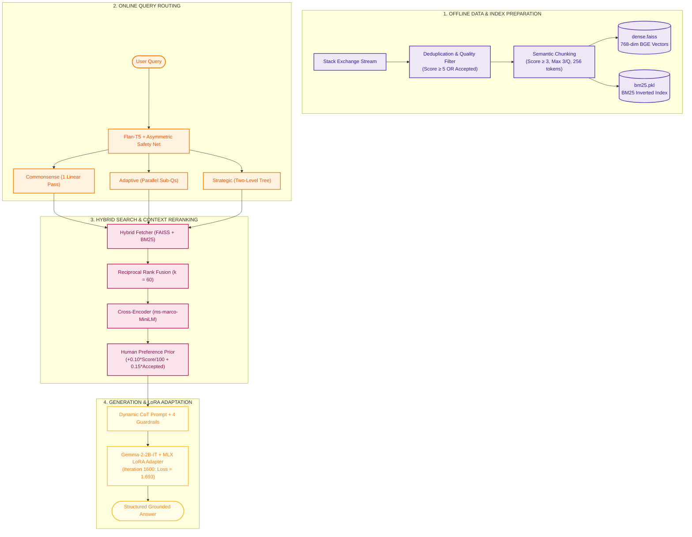

# Reasoning-Augmented RAG (Reasoning-RAG)

> **Contextual, Adaptive & Strategic Reasoning over Retrieval-Augmented Generation**  
> A production-grade, 100% local RAG system built on Stack Exchange data, featuring hybrid retrieval, query classification, cross-encoder reranking, and LoRA fine-tuning on Apple Silicon via MLX.

---

## 📂 Project Navigation

* **Complete Project Code & Models:** [`reasoning-rag/`](file:///Users/poojan/Downloads/Reasoning-RAG-main/reasoning-rag)
* **Comprehensive Architecture Documentation & Benchmarks:** [`reasoning-rag/README.md`](file:///Users/poojan/Downloads/Reasoning-RAG-main/reasoning-rag/README.md)
* **System Protocol Specification:** [`README_EndToEnd_Protocol.md`](file:///Users/poojan/Downloads/Reasoning-RAG-main/README_EndToEnd_Protocol.md)
* **Ordered Implementation Steps:** [`README_OrderedSteps.md`](file:///Users/poojan/Downloads/Reasoning-RAG-main/README_OrderedSteps.md)

---

## 🏛 System Architecture Overview



---

## 🚀 Quickstart

```bash
cd reasoning-rag
pip install -r requirements.txt

# Run the interactive Reasoning CLI demo
python3 src/demo.py --adapter outputs/gemma-2-2b-it-mlx-lora-v2/0001600_adapters.safetensors

# Run the head-to-head comparison harness (Base vs. Fine-Tuned)
python3 src/evaluation/compare_demo.py --adapter outputs/gemma-2-2b-it-mlx-lora-v2/0001600_adapters.safetensors
```

For the complete technical breakdown, mathematical formulas, evaluation metrics, and design trade-offs, see the full [reasoning-rag/README.md](file:///Users/poojan/Downloads/Reasoning-RAG-main/reasoning-rag/README.md).
