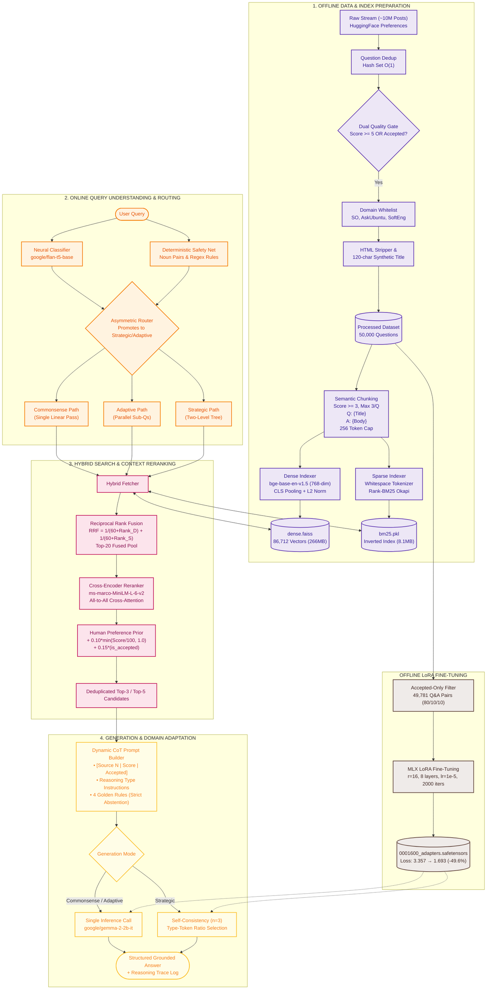

# Reasoning-Augmented RAG (Reasoning-RAG)

> **Contextual, Adaptive & Strategic Reasoning over Retrieval-Augmented Generation**  
> Built on Stack Exchange Preferences data, powered by **Gemma-2-2B-IT**, **Apple MLX**, **FAISS**, **Rank-BM25**, **Flan-T5**, and **Cross-Encoder Reranking** — running **100% locally** on Apple Silicon & CUDA.

---

## 📑 Table of Contents

1. [Architecture Overview](#-architecture-overview)
2. [End-to-End System Pipeline](#-end-to-end-system-pipeline)
3. [Deep Dive into Pipeline Layers](#-deep-dive-into-pipeline-layers)
   - [1. Data Ingestion & Dual-Gate Filtering](#1-data-ingestion--dual-gate-filtering)
   - [2. Semantic Chunking & Token Budgeting](#2-semantic-chunking--token-budgeting)
   - [3. Dense Retrieval (FAISS IndexFlatIP)](#3-dense-retrieval-faiss-indexflatip)
   - [4. Sparse Retrieval (BM25Okapi)](#4-sparse-retrieval-bm25okapi)
   - [5. Hybrid Fusion (Reciprocal Rank Fusion)](#5-hybrid-fusion-reciprocal-rank-fusion)
   - [6. Context-Aware Cross-Encoder Reranking](#6-context-aware-cross-encoder-reranking)
   - [7. Query Understanding & Asymmetric Router](#7-query-understanding--asymmetric-router)
   - [8. Reasoning Engine Execution Topologies](#8-reasoning-engine-execution-topologies)
   - [9. Prompt Construction, Guardrails & Self-Consistency](#9-prompt-construction-guardrails--self-consistency)
   - [10. Hardware-Accelerated LoRA Fine-Tuning](#10-hardware-accelerated-lora-fine-tuning)
   - [11. Retrieval & Generation Evaluation Suite](#11-retrieval--generation-evaluation-suite)
   - [12. Documented Bugs & Broken Design Assumptions](#12-documented-bugs--broken-design-assumptions)
   - [13. Architectural Trade-Offs & Production Scaling](#13-architectural-trade-offs--production-scaling)
4. [Quickstart & Demo](#-quickstart--demo)
5. [Repository Structure](#-repository-structure)
6. [Hardware & Software Requirements](#-hardware--software-requirements)

---

## 🏛 Architecture Overview



---

## ⚡ End-to-End System Pipeline

```
====================================================================================================
1. INGESTION & FILTERING ──► 50,000 Questions from Stack Exchange (Score ≥ 5 OR Accepted)
2. SEMANTIC CHUNKING     ──► 86,712 Chunks ("Q: {Title}\nA: {Body}", 1024 chars, 256 tokens)
3. DUAL INDEXING         ──► Dense FAISS IndexFlatIP (768-dim) + Sparse BM25Okapi Inverted Index
4. QUERY ROUTING         ──► Flan-T5 Classifier + Asymmetric Rule Safety Net (Commonsense/Adaptive/Strategic)
5. REASONING ENGINE      ──► Linear (1 pass) | Adaptive (Parallel Sub-Qs) | Strategic (Two-Level Tree)
6. HYBRID SEARCH & RRF   ──► Top-20 Dense + Top-20 Sparse Fused via RRF (k = 60)
7. CONTEXT RERANKING     ──► Cross-Encoder + Human Preference Prior (+0.10*Score/100 + 0.15*Accepted)
8. GROUNDED GENERATION   ──► Dynamic CoT Prompt + Gemma-2-2B-IT with LoRA Adapter (MLX / PyTorch)
9. EVALUATION & TRACE    ──► Recall@5, ROUGE-L, BERTScore F1 + Full Reasoning Trace JSON
====================================================================================================
```

---

## 🔍 Deep Dive into Pipeline Layers

### 1. Data Ingestion & Dual-Gate Filtering
* **Dataset Source:** `HuggingFaceH4/stack-exchange-preferences` streamed over network buffers to maintain an under-300MB RAM footprint.
* **Deduplication:** Global in-memory hash set on 64-bit integer Question IDs ($\mathcal{O}(1)$ uniqueness lookup).
* **Dual Quality Floor:** Questions are retained **only if** they contain at least one answer with `Score >= 5` **OR** an author-accepted answer (`selected == True`). This eliminates spam, abandoned questions, and low-signal threads while preserving verified niche solutions.
* **Domain Whitelisting:** Scoped strictly to 3 core computer engineering domains (`stackoverflow`, `askubuntu`, `softwareengineering`) to eliminate vocabulary polysemy across non-software disciplines.
* **Text Normalization:** Strips HTML DOM noise and extracts a **120-character synthetic title preview** from the cleaned question body to anchor downstream embeddings.

### 2. Semantic Chunking & Token Budgeting
* **1 Answer = 1 Atomic Chunk:** Preserves complete logical units (setup $\rightarrow$ execution $\rightarrow$ return statements) without syntax breakage.
* **Per-Question Selection:** Filters candidate answers with `Score >= 3` or `is_accepted == True` (fallback to top-1 by score), sorted by acceptance and score descending, capped at **maximum 3 answers per question**.
* **Asymmetric Context Prepending:** Formatted as `"Q: {Title}\nA: {Body}"` to solve the *Asymmetric Context Void* (anchoring solution text to problem intent).
* **Two-Tier Truncation Budget:**
  1. *String Slicing:* Hard character cap at **1,024 characters** before tensor batching.
  2. *Tokenizer Slicing:* Truncated to **256 tokens** with CLS pooling, cutting quadratic self-attention ($\mathcal{O}(N^2)$) compute and VRAM by 75% compared to 512 tokens.

### 3. Dense Retrieval (FAISS IndexFlatIP)
* **Embedding Model:** `BAAI/bge-base-en-v1.5` (768-dimensional float32 representations).
* **Pooling & Normalization:** Extracts index-0 `[CLS]` token and applies **L2 unit normalization** ($\|\mathbf{e}\|_2 = 1.0$).
* **Vector Math:** Because vectors are unit-normalized, **Inner Product equals Cosine Similarity**:
  $$\text{Similarity}(\mathbf{u}, \mathbf{v}) = \mathbf{u} \cdot \mathbf{v} = \sum_{i=1}^{768} u_i v_i$$
* **Index Architecture:** FAISS `IndexFlatIP` storing 86,712 vectors (~266 MB RAM) performing exact, exhaustive BLAS matrix-vector multiplications in **~3 to 5 ms** with 100% exact recall.

### 4. Sparse Retrieval (BM25Okapi)
* **Algorithm:** `BM25Okapi` inverted index built over whitespace-tokenized chunk strings (`index/bm25.pkl`, ~8.1 MB).
* **Exact Syntax Catching:** Catches specific API identifiers (`torch.cuda.empty_cache`), CLI flags (`git reset --hard`), error codes (`HTTP 429`, `0xC0000005`), and system signals (`SIGSEGV`) that dense vector models blur into general semantic clusters.
* **Mathematical Principles:** Inverse Document Frequency (IDF) penalizes common stop words, while Term Frequency saturation ($k_1 = 1.5$) prevents keyword stuffing.

### 5. Hybrid Fusion (Reciprocal Rank Fusion)
* **The Problem Solved:** Eliminates score scale incompatibility (bounded $[-1, 1]$ cosine similarity vs. unbounded $[0, 85+]$ BM25 scores).
* **RRF Formula ($k = 60$):**
  $$\text{RRF Score}(d) = \frac{1}{60 + \text{Rank}_{\text{dense}}(d)} + \frac{1}{60 + \text{Rank}_{\text{sparse}}(d)}$$
* **Consensus Promotion:** Dual hits appearing in both dense and sparse top lists receive nearly $2\times$ score boost ($0.0315$ vs $0.0163$), bubbling high-confidence consensus documents to the top of the 20-candidate pool.

### 6. Context-Aware Cross-Encoder Reranking
* **Model:** `cross-encoder/ms-marco-MiniLM-L-6-v2` performing full token-to-token all-to-all cross-attention across $(Query, Document)$ pairs.
* **Human Preference Blending Formula:**
  $$\text{Final Score} = \text{Base CE Logit} + 0.10 \times \min\left(\frac{\text{Upvote Score}}{100}, 1.0\right) + 0.15 \times \mathbb{I}(\text{Accepted})$$
* **Tie-Breaker Effect:** Leverages human validation metadata to elevate community-verified best practices over unvetted answers with superficial keyword overlap.

### 7. Query Understanding & Asymmetric Router
* **Neural Classifier:** `google/flan-t5-base` (250M parameter Seq2Seq model) prompted with few-shot examples to predict `Intent`, `Reasoning Type`, `Scope`, and `Sub-questions`.
* **Deterministic Safety-Net Rules:** Hardcoded technology pairs (e.g., `("sql", "nosql")`, `("tcp", "udp")`) and regex comparison patterns (`" vs "`, `"tradeoffs between"`).
* **Asymmetric Override Rule:** The safety net **only promotes** a query if the model under-classified it as `commonsense`, and **never downgrades** a complex classification.

### 8. Reasoning Engine Execution Topologies

| Reasoning Path | Target Complexity | Search Topology | Retrieval Budget | LLM Generation Mode |
| :--- | :--- | :--- | :--- | :--- |
| **Commonsense** | Simple, factual, syntax | Single linear pass | 1 search $\rightarrow$ Top-5 reranked | Single forward pass |
| **Adaptive** | Multi-part concept + usage | Parallel fan-out | 2–3 sub-queries $\rightarrow$ Top-3/branch | Single unified synthesis |
| **Strategic** | Comparisons & tradeoffs | Hierarchical two-level tree | 1 Broad + 3 Sub-Qs (4 searches) | **Self-Consistency ($n=3$)** |

### 9. Prompt Construction, Guardrails & Self-Consistency
* **Dynamic Chain-of-Thought (CoT):** Injects reasoning-specific instructions (Commonsense: thorough explanation; Adaptive: sub-question resolution; Strategic: dimensions $\rightarrow$ tradeoffs $\rightarrow$ recommendation).
* **The 4 Golden Rules:**
  1. Grounded strictly in retrieved evidence.
  2. **Strict Abstention Phrase:** *"The retrieved sources do not contain enough information to answer this question."*
  3. Structured synthesis over verbatim copying.
  4. Mandatory Markdown code blocks (` ```language `).
* **Self-Consistency with Lexical Diversity:** For Strategic queries, generates $n=3$ candidate responses and selects the winner with the highest **Type-Token Ratio** ($\text{len}(\text{set}(\text{tokens})) / \text{len}(\text{tokens})$), ensuring complete multi-dimensional coverage.

### 10. Hardware-Accelerated LoRA Fine-Tuning
* **Base Model:** `google/gemma-2-2b-it` (2 billion parameters).
* **Dataset:** **49,781 Accepted-Only Q&A pairs** formatted into Gemma-IT chat turns (80% train / 10% val / 10% test).
* **MLX Training Config (v2 Best):** $r=16, \alpha=32$, 8 LoRA attention layers, learning rate $1\times 10^{-5}$, gradient checkpointing, batch size 1.
* **Validation Loss Results:**
  * Baseline (Iter 1): `3.357`
  * Iteration 400: `1.945`
  * **Iteration 1600 (Best Saved): `1.693` ($-49.6\%$ loss reduction)**
  * Iteration 2000: `2.199`

---

## 📊 Evaluation & Empirical Results

### Head-to-Head Comparison: Base Model vs. Fine-Tuned (Iter 1600 Adapter)

Evaluated across 5 representative Stack Overflow categories (`compare_demo.py`):

| Query | Base Gemma-2-2B-IT | Fine-Tuned (Iter 1600 LoRA) | Winner | Key Difference |
| :--- | :--- | :--- | :--- | :--- |
| **1. Reverse a list in Python** | Terse lambda, no Markdown block. | Full function + comments + Markdown block. | ✅ **Fine-Tuned** | Proper code formatting and explanation. |
| **2. `==` vs `is` in Python** | Abstention triggered. | Abstention triggered. | **Tie** | Proper retrieval miss handling (Rule 2). |
| **3. Segfault in C** | Verbose, rambling narrative. | Clean, direct pointer diagnosis. | ✅ **Fine-Tuned** | Direct, expert tone. |
| **4. `git rebase` explanation** | Leaked raw SO URL into output. | Paraphrased cleanly with zero URL leaks. | ✅ **Fine-Tuned** | Clean synthesis without scraper artifacts. |
| **5. `async/await` in Python** | Abstention triggered. | Abstention triggered. | **Tie** | Zero hallucination on index miss. |

* **Win Rate:** **Fine-tuned wins 3/5 (60%)**, **2 Ties (40%)**, **0 Losses**.
* **Average Latency (Apple Silicon):** Base: `79.0s` | Fine-Tuned: `91.7s` (due to complete code block generation).

---

## 🛠 Documented Bugs & Broken Design Assumptions

| # | Symptom / Bug | Root Cause & Broken Assumption | Resolution in Codebase |
| :--- | :--- | :--- | :--- |
| **1** | **Indexing took 2+ hours** on 199k chunks. | Assumed all answers in a thread are needed. | Set `MIN_SCORE = 3` and capped at `MAX_ANSWERS = 3` (pruned 199k $\rightarrow$ 86k chunks). |
| **2** | **MPS GPU OOM crash** at `batch=512`. | Assumed local Apple Silicon unified RAM handles server-scale batches. | Dropped embedding batch size to `BATCH_SIZE = 32`. |
| **3** | **macOS Python Segfault (`SIGSEGV`)**. | `SentenceTransformer` multi-process worker pools conflict with Apple Metal GPU drivers. | Replaced wrapper with raw PyTorch loop (`AutoModel` + `torch.no_grad()`) in main process. |
| **4** | **FAISS Dimension Mismatch Error**. | Indexer used 768-dim `bge-base`; search used 1024-dim `bge-large`. | Strictly aligned all modules to 768-dim `BAAI/bge-base-en-v1.5`. |
| **5** | **Blank Question Titles (`Q: \nA: ...`)**. | Assumed streaming schema had a standalone title field. | Extracted first 120 chars of cleaned question body as synthetic title. |
| **6** | **MLX CLI Training Crash**. | Newer `mlx_lm` package renamed `--lora-layers` to `--num-layers`. | Updated subprocess argument mapping in `train_mlx.py`. |
| **7** | **Terse 1-Sentence Answer Regression**. | Prompt said *"concisely"* and Rule 3 forbade expansion, causing LLM to drop code blocks. | Rewrote prompt to mandate thorough explanations (3–4 sentences), code blocks, and citations. |

---

## ⚖️ Architectural Trade-Offs & Production Scaling

| Dimension | Current Local Implementation | Production Scaling Strategy (>5M Vectors) |
| :--- | :--- | :--- |
| **Vector Storage** | Local FAISS `IndexFlatIP` (~266 MB in RAM) | Distributed Vector DB (Qdrant / Milvus) with HNSW graphs & Scalar Quantization (SQ8). |
| **Sparse Index** | In-Memory `rank_bm25` pickle file | Distributed Elasticsearch / OpenSearch cluster with disk-backed inverted posting lists. |
| **Sub-Query Execution**| Sequential `for` loop in Python | Concurrent asynchronous dispatch via `asyncio.gather` and batched Cross-Encoder inference. |
| **Context Allocation** | Fixed `retrieved_chunks[:3]` slice | Stratified prompt allocation (reserving 1 slot per decomposed sub-query branch). |
| **LLM Inference** | Single-device Apple MLX / PyTorch | Distributed vLLM cluster with continuous batching, PagedAttention, and FP8 quantization. |

---

## 🚀 Quickstart & Demo

### 1. Installation
```bash
git clone https://github.com/poojann-pandyaa/Reasoning-RAG.git
cd Reasoning-RAG/reasoning-rag
pip install -r requirements.txt
```

### 2. Build or Rebuild Indices
```bash
# 1. Ingest and filter Stack Exchange stream
python3 src/ingestion/preprocess.py

# 2. Build dense FAISS vector index (MPS / CUDA accelerated)
python3 src/retrieval/dense_index.py

# 3. Build sparse BM25 index
python3 src/retrieval/sparse_index.py
```

### 3. Run Interactive Reasoning CLI
```bash
# Run with Base Gemma-2-2B-IT
python3 src/demo.py

# Run with Best Fine-Tuned LoRA Checkpoint (Iteration 1600)
python3 src/demo.py --adapter outputs/gemma-2-2b-it-mlx-lora-v2/0001600_adapters.safetensors
```

### 4. Run Head-to-Head Comparison Harness
```bash
python3 src/evaluation/compare_demo.py \
    --adapter outputs/gemma-2-2b-it-mlx-lora-v2/0001600_adapters.safetensors
```

### 5. Train LoRA Adapter (MLX Apple Silicon)
```bash
# Full v2 training run (2,000 iterations, accepted-only dataset)
python3 src/train_mlx.py --v2
```

---

## 📁 Repository Structure

```
reasoning-rag/
├── configs/
│   └── taxonomy.json             # 16-domain Stack Exchange category mapping
├── data/
│   ├── processed_dataset.jsonl   # Preprocessed canonical Q&A records
│   └── mlx_data/                 # Train / Valid / Test splits (80/10/10)
├── index/
│   ├── dense.faiss               # 86,712-vector FAISS Flat Inner-Product index
│   ├── bm25.pkl                  # Serialized BM25Okapi lexical index
│   └── metadata.json             # Full chunk text and preference metadata
├── outputs/
│   └── gemma-2-2b-it-mlx-lora-v2/
│       └── 0001600_adapters.safetensors  # Optimal LoRA checkpoint (Loss: 1.693)
├── assets/
│   └── val_loss_lora.png         # LoRA validation loss convergence curve
├── src/
│   ├── demo.py                   # Interactive reasoning CLI demo
│   ├── train_mlx.py              # MLX LoRA training pipeline (Apple Silicon)
│   ├── train.py                  # PyTorch / QLoRA training script (CUDA)
│   ├── ingestion/
│   │   ├── preprocess.py         # Stream ingestion, dedup, and HTML cleaning
│   │   └── prepare_finetune.py   # SFT chat template formatter (Accepted-only)
│   ├── retrieval/
│   │   ├── dense_index.py        # FAISS embedding builder (bge-base-en-v1.5)
│   │   ├── sparse_index.py       # BM25 index builder
│   │   ├── hybrid_search.py      # Reciprocal Rank Fusion (RRF k=60) engine
│   │   └── reranker.py           # Cross-Encoder reranker + preference prior
│   ├── reasoning/
│   │   ├── classifier.py         # Flan-T5 classifier + Asymmetric safety net
│   │   └── engine.py             # Reasoning engine (Commonsense/Adaptive/Strategic)
│   ├── generation/
│   │   ├── generator.py          # FinalGenerator (MLX / HF API / PyTorch)
│   │   └── trace.py              # Reasoning trace telemetry logger
│   └── evaluation/
│       ├── compare_demo.py       # Side-by-side base vs. fine-tuned test harness
│       └── evaluator.py          # Recall@5, ROUGE-L, and BERTScore evaluators
└── requirements.txt              # Pinned Python package dependencies
```

---

## 💻 Hardware & Software Requirements

* **Operating System:** macOS (Apple Silicon M1/M2/M3/M4) or Linux (Ubuntu 20.04+ with CUDA GPU).
* **Python Version:** Python 3.9+ (Python 3.10/3.11 recommended).
* **Memory (RAM):** 16 GB minimum (24 GB+ recommended for overnight LoRA training).
* **Key Dependencies:** `mlx`, `mlx-lm`, `faiss-cpu`, `rank-bm25`, `sentence-transformers`, `transformers`, `torch`, `peft`, `trl`, `evaluate`, `rouge_score`, `bert_score`.

---
